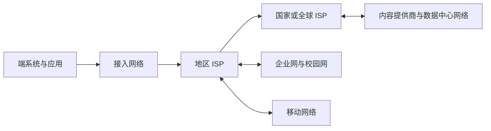
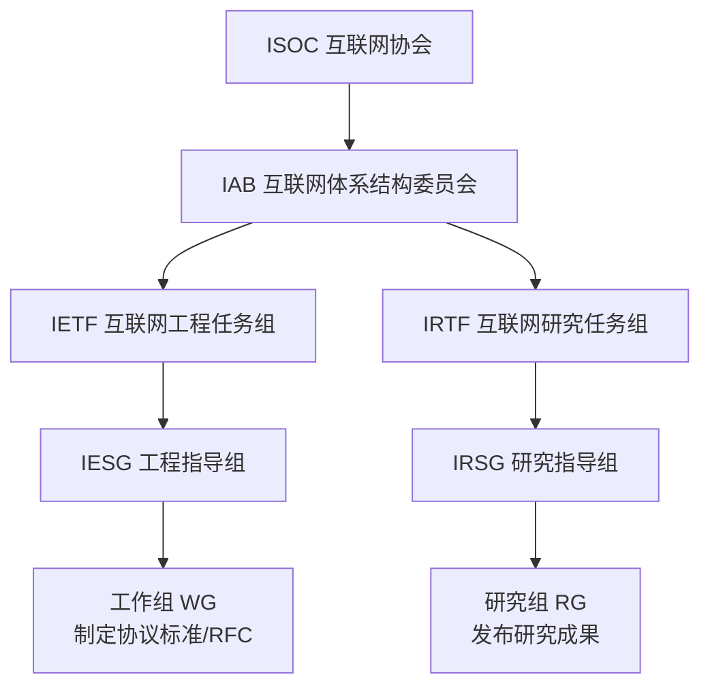

# 第一章　课程概览与网络发展

> 对应课件：`第一讲_(1) 课程介绍.pptx`。课程时间、人员、考核、作业规则和宣传性内容已省略。

## 1. 学习目标

- 掌握计算机网络的基本概念，以及以 TCP/IP 为核心的 Internet 各层协议的工作原理。
- 理解网络系统常用的设计方法：分层、分组交换、端到端原则、开放标准和演进式设计。
- 能通过实验实现和分析网络协议，为后续网络系统、应用与安全研究打下基础。

## 2. 从“网络”到“计算机网络”

网络可以抽象为图：结点（node）通过链路（link）相连。通信网络的目的，是沿链路在结点之间传递内容。计算机出现以前，烽火台、驿站、公路、电报和电话网络已经体现了这种结构。

计算机网络具有三个基本要素：

- **结点**：个人计算机、服务器、手机、路由器、交换机以及各类智能设备。
- **链路**：双绞线、同轴电缆、光纤、无线电或激光链路。
- **传输对象**：由 0/1 比特构成的数字信息。

评价网络不能只看“能否连通”，还要看它提供的服务及服务质量：通信主体、功能和接口，丢失率、带宽、时延、抖动、稳定性，以及可靠性、安全和隐私保障。

计算机网络也是云计算、大数据、人工智能、智慧城市、“东数西算”等上层系统的共同基础；这些系统又依赖光传输、Wi‑Fi、蜂窝通信等底层技术。

互联网（Internet，也称因特网）由 ARPANET 演进而来，以 IP 为共同技术基础，是多个自治网络互连形成的“网络的网络”。

### Internet 与 internet

| 概念 | Internet | internet |
|---|---|---|
| 含义 | 特指遵循 TCP/IP、借助路由器互连而成的全球网络 | 泛指由多个不同类型网络互连得到的网络 |
| 协议 | 以 TCP/IP 为基础 | 可以采用 TCP/IP 之外的协议 |
| 词性 | 专有名词 | 通用名词 |

## 3. Internet 的形成与演进

### 3.1 关键时间线

ARPANET 最初连接 UCLA、SRI、UCSB 和 Utah。其早期的代表性思想包括 Paul Baran 提出的**分布式体系结构和分组交换**，以及面向终端系统互操作的协议规范。到 20 世纪 80 年代中期，Internet 已跨越北美、欧洲和澳大利亚。

“互联网诞生”常有两种口径：

1. 1969 年 ARPANET 建成，标志分组交换网络原型出现；
2. 1983 年 ARPANET 采用 TCP/IP，标志现代 Internet 的共同互连基础形成。

互联网并不是按一张预先完成的蓝图建成的。它依靠理论突破、原型实验、政府长期资助、教育科研示范网、开放协作的 IETF/RFC 机制，以及工程实践中的持续试错逐步演进。TCP/IP 的简单实用和开放实现，是其胜出的重要原因。

### 3.2 Web 与接入能力演进

| 阶段 | 代表应用 | 典型接入 | 内容特征 |
|---|---|---|---|
| Web 1.0（约 1993—1999） | 浏览器、门户、电子商务 | ISDN，约 64 kbit/s | 下载和静态内容为主 |
| Web 2.0（约 2000—2007） | 博客、社交媒体、在线视频 | DSL/LAN，约 10 Mbit/s | 用户大量生产数据，动态内容成为主导 |
| 移动互联网 | 导航、网购、移动支付、“互联网+” | 光纤到户与 4G，约 100 Mbit/s | 随时随地接入 |
| 智能互联 | 万物互联、AI 服务 | 5G 及一体化网络 | 端、边、云协同 |

1990 年代以来的代表性事件包括 Mosaic 浏览器、W3C、网景与 IE 的竞争、互联网商业化；2000 年互联网泡沫破裂的同时，一批搜索、社交和云服务公司成长；随后“大数据”“云计算”逐渐成形，智能手机与 3G/4G 推动移动互联网，网络又成为大规模 AI 训练和推理的基础设施。

### 3.3 其他国家的早期网络设想

- 英国有 NPL Mark I，法国有 CYCLADES；它们与美国的 ARPANET 一样探索了分组交换和网络互连。
- 苏联的“红书”设想和 OGAS 计划尝试以计算机网络支撑国家经济管理。OGAS 由 Victor Glushkov 于 1960 年代构思，设想“一个中央超级结点、两百多个中等结点、两万个终端结点”，连接大量工业和农业组织，并包含无纸化办公、电子货币、自然语言编程等超前构想。
- 多条技术路线长期竞争，最终 TCP/IP 与 WWW 的组合形成了开放、可扩展的主流体系。

### 3.4 中国互联网的重要节点

- 1987 年，第一个电子邮件结点从北京向德国发出邮件：“越过长城，走向世界”。
- 1994 年，通过 64 kbit/s 专线实现全功能 Internet 连接。
- “宽带中国”经历全面提速、推广普及和优化升级，接入方式由拨号、双绞线逐步升级到光纤入户。
- 2009 年发放 3G 牌照，2013 年发放 4G（TD-LTE）牌照，2019 年发放 5G 商用牌照。
- 主要骨干网络包括 CHINANET、UNINET、CMNET、CERNET 和 CSTNET。

课件列出的网民规模、基站数、出口带宽、地址和域名数量均为历史快照，应结合统计年份理解。

课件给出的历史快照为：网民约 10 亿、普及率约 70%；2019 年底国际出口带宽超过 8.8 Tbit/s；4G 基站 551 万个；2020 年底 5G 基站约 70 万个；IPv4 地址约 3.8 亿个，IPv6 地址 50 903 块 `/32`；`.cn` 域名约 2 304 万个；在架应用约 359 万款。这些数字只用于理解当时规模，不代表当前值。

## 4. 现有互联网的主要问题

Internet 最初面向相互信任的用户和军用/科研场景，没有预见今天的用户、数据和应用规模。因此，当前问题集中在安全与隐私、性能、运维，以及政策、法规和伦理几个方面。

### 4.1 安全与隐私

#### 恶意软件

- **病毒（virus）**：依赖一定的用户交互传播，例如用户打开带有恶意可执行代码的邮件附件。
- **蠕虫（worm）**：可独立运行，无需明显的用户交互；它主动扫描有漏洞的主机并自动传播。
- **WannaCry**：由利用 Windows MS17-010 漏洞的“永恒之蓝”传播组件和加密文件的勒索组件构成。未修补系统会被入侵，文档、图片、音视频等文件被加密并改为 `.WNCRY` 后缀，攻击者以比特币索要赎金。课件备注指出该事件波及至少 150 个国家、约 30 万用户，并影响金融、能源、医疗、校园网和企业系统。

#### 拒绝服务与基础设施风险

拒绝服务攻击（DoS/DDoS）通过制造大量虚假流量占用服务器、链路或 DNS 等资源，使合法用户无法获得服务。云服务或公共 DNS 的故障会沿依赖链扩散，造成大量上层网站同时不可用。

#### 凭据、后门与监听

- **拖库**：窃取网站用户数据库；**洗库**：整理、交易或变现泄露数据；**撞库**：把一个站点泄露的用户名和密码用于其他站点。
- 防护要点是使用足够复杂、互不相同的密码，并减少凭据复用。
- **后门**是绕过常规安全控制而获得程序或系统访问权的机制；**网络监听**是截获和分析网络上传输的信息。

网络空间已成为重要战略空间。安全设计不仅要研究攻击手段和防御方法，还要追求对攻击更有免疫力的体系结构。

### 4.2 性能与海量数据

- **尼尔森定律**：课件用“网络连接速度每年增长约 50%”概括接入带宽的长期增长，其速度仍可能落后于应用需求增长。
- **安迪—比尔定律**：“What Andy gives, Bill takes away”，意指硬件和网络能力的增长会迅速被软件需求消耗。
- 社交媒体、邮件、搜索、联网汽车、可穿戴设备和视频持续制造海量数据；AI 集群又产生巨大的东西向通信。
- 课件引用的 2019 年“每日数据”示例包括：约 5 亿条推文、2 940 亿封电子邮件、Facebook 约 4 PB 数据（约 3.5 亿张照片和 1 亿小时视频）、WhatsApp 约 650 亿条消息、约 50 亿次搜索、可穿戴设备约 28 PB 数据、Instagram 约 9 500 万份照片和视频；单辆联网汽车可产生 TB 级数据。它们是说明增长量级的历史估计。
- 极端情况下，物理运输存储设备可能比公网传输更高效。AWS Snowmobile 用卡车运载最高约 100 PB 的存储设备，把企业数据中心的数据经本地光纤灌入设备，再运至 AWS 数据中心。

### 4.3 网络管理与灰色故障

大规模网络包含大量设备、复杂功能和难以复现的状态。现有工具常产生海量、粒度过低的日志，需要人工拼接分析。

**灰色故障（gray failure）**是系统和应用对健康状态判断不一致的故障，例如间歇性/随机丢包、性能下降或电子元件老化。它既没有完全失效，也不是完全正常，因此比显式宕机更难发现和定位。

图中的四种状态分别是：系统与应用都认为健康（All Good）；二者都认为异常（Detected Failure）；系统认为异常但应用仍显得健康（Masked Failure）；系统认为健康而应用已异常（Gray Failure）。

-课程介绍/153-9f8e973264.png>)

### 4.4 社会治理

互联网的匿名性、平台垄断、算法影响和跨境数据流动带来新的治理问题。隐私法规（如欧盟 GDPR）、平台审查、数据使用边界和责任追溯，已成为网络设计之外必须考虑的约束。

## 5. 未来网络与热点方向

### 5.1 研究计划与总体目标

- 美国 NSF 在 2010 年启动多个 Future Internet Architecture 项目；业界与高校也持续开发新型网络技术。
- DARPA 于 2021 年资助 Pronto，核心方向包括网络可编程、面向 5G、把网络视为分布式计算系统、自动化验证、闭环控制和开放测试环境。
- 中国的相关研究计划强调弥补“上层互联网应用强、底层通信技术强，而中间网络体系结构相对薄弱”的问题。

### 5.2 新型场景

- **主机网络**：单机 I/O 能力快速增长，虚拟机与容器带来新的隔离和转发需求。
- **移动网络**：无线信道更不可靠，终端位置和接入点会变化。
- **数据中心网络**：连接数十万服务器，时延会直接影响用户体验和经济收益。
- **AI 智算网络**：模型并行切分产生大量通信，通信可能跨服务器、跨机架乃至跨数据中心，形成“通信墙”。
- **卫星网络**：低轨星座通过降低轨道高度缩短传播时延，但需要大量高速移动的卫星实现连续覆盖。

### 5.3 新硬件、新协议与新软件

- **可编程交换机**支持网内计算；**智能网卡/DPU**把协议处理、存储访问、虚拟化和安全功能从 CPU 卸载到网卡。
- **RDMA**减少 CPU 参与和数据复制，用于高性能存储与集群通信。
- 协议从传统的 HTTP/1.x + TLS + TCP 演进到 HTTP/2、QUIC 与 HTTP/3；新硬件和新应用共同推动协议栈变化。
- DPDK 等用户态网络框架允许程序更直接地访问网卡，改变“内存访问远快于网络 I/O”的传统软件假设。

### 5.4 网络数据分析

网络管理正从单点算法和黑盒设备，走向软件定义、可编程设备、全网数据收集和智能协同控制。目标可概括为：

- 历史可追溯；
- 现状可感知；
- 未来可预测。

## 6. 标准化组织与学术共同体

- **IETF**负责互联网工程标准的实际制定；**IRTF**偏长期研究，通常不直接制定协议标准。
- **ISO**提出 OSI 参考模型；**ITU**是政府间电信标准组织。
- **IEEE**制定大量局域网和通信标准；Wi‑Fi 联盟推进互操作认证；**W3C**负责 Web 相关标准。
- 中国通信标准化协会 **CCSA** 的技术委员会覆盖互联网与应用、网络与业务能力、通信电源与局站环境、无线通信、传送网与接入网、网络管理与运营支撑、网络与信息安全、电磁环境与安全防护、物联网、移动互联网应用与终端、航天通信等方向。

网络领域的重要会议包括 ACM SIGCOMM、USENIX NSDI、IEEE INFOCOM 和 ACM MobiCom，分别侧重网络基础与系统、网络系统、广泛的网络通信研究以及移动/无线网络。

## 7. 本章小结

计算机网络以结点、链路和协议协同实现数字信息传输。Internet 的成功源于分组交换、TCP/IP、开放标准和持续演进，而不是一次性设计。今天的网络同时面临安全、隐私、性能、海量数据和运维挑战；可编程硬件、QUIC/HTTP/3、数据中心与 AI 网络、智能运维和卫星网络构成重要演进方向。
