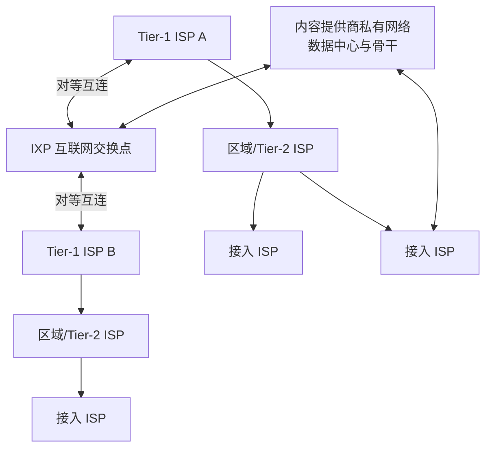
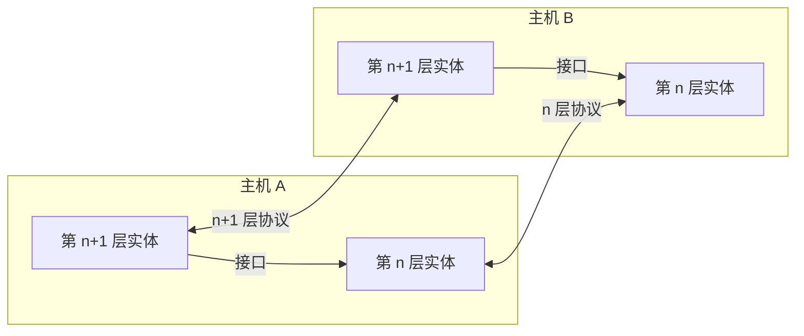

# 第二章　网络基础知识

> 对应课件：`第一讲_(2) 网络基础知识.pptx`。连续动画页已合并为完整过程。

## 1. 研究网络的基本框架

计算机网络的基本目标是传输信息；工程目标是让传输更快、更稳定、更易用。面对高度复杂的网络，常用“分而治之”：把大问题分解为实体、服务、协议、实现与管理，再逐项解决并组合。

- **实体**：由哪些设备/进程参与；如何命名；如何组织。
- **服务**：提供什么传输接口；性能如何；是否有可靠性与安全保障。
- **协议**：通信内容的格式、语义和先后顺序。
- **实现与管理**：把功能和协议映射到实体，并分配链路、交换、队列等资源。

## 2. 网络的组成

### 2.1 按覆盖范围分类

| 类型 | 全称 | 范围与例子 |
|---|---|---|
| PAN | Personal Area Network | 通常在约 10 m 半径内连接个人设备，如蓝牙耳机 |
| LAN | Local Area Network | 办公室、楼宇、家庭、企业或校园内的局部网络 |
| MAN | Metropolitan Area Network | 覆盖一座城市 |
| WAN | Wide Area Network | 覆盖地区、国家乃至全球 |

Internet 是由大量子网组成的“网络的网络”。ISP（Internet Service Provider）提供接入和网络互连服务。

### 2.2 网络边缘、接入网与网络核心


- **网络边缘**：运行应用程序的端系统。主机把应用数据发向接入网，也从网络接收数据交给应用。
- **接入网**：把端系统连接到边缘路由器。边缘路由器是端系统通往远端系统路径上的第一台路由器。
- **网络核心**：由分组交换设备和通信链路构成的网状网络，负责把海量端系统互连。

主机内部由三部分协作：网卡负责外部通信；内核驱动管理具体网卡，内核协议栈处理网络数据；用户程序通过 socket 接口发送和接收数据。

### 2.3 主机命名

- **MAC 地址**：网卡标识，48 位；地址空间由 IEEE 分配给厂商，厂商保证出厂设备不重名。硬件地址通常写入网卡，但实际系统可以配置或伪装对外使用的地址。
- **IP 地址**：IPv4 为 32 位，IPv6 为 128 位；可按网络管理需要配置。
- **主机名/域名**：便于人类记忆的字符串，由 DNS 映射到 IP 地址。

## 3. 物理介质与接入技术

### 3.1 单位

- 传输基本单位是 bit；$1\,\mathrm{B}=8\,\mathrm{b}$。
- 课件按常见口径区分：存储容量的 K/M/G 常按 $2^{10}$ 进位，网络速率的 k/M/G 常按 $10^3$ 进位。

### 3.2 引导型与非引导型介质

| 介质 | 特点 |
|---|---|
| 双绞线 | 两根绝缘铜线互绞；电话线常为 1 对，网线常为 4 对；五类约 100 Mbit/s～1 Gbit/s，六类可达 10 Gbit/s |
| 同轴电缆 | 同心铜导体，双向传输，可按频率划分多个通道；课件给出约 100 Mbit/s 的典型能力 |
| 光纤 | 光脉冲承载比特；高速、低误码、抗电磁干扰，中继距离长；点到点速率可达 10～100 Gbit/s 以上 |
| 无线电 | 无物理导线，受反射、遮挡、干扰和噪声影响；常为半双工 |

无线链路包括蓝牙、Wi‑Fi、蜂窝网络、地面微波和卫星。同步卫星轨道高度约 36 000 km，课件给出约 280 ms 的往返传播时延；低轨卫星更近、时延更低，但需要大量高速运动的卫星连续覆盖。

### 3.3 住宅与机构接入

#### DSL

数字用户线 DSL 使用电话双绞线连接 DSLAM。语音和数据用不同频带，可同时传输；早期拨号上网则不能同时传语音和数据。ADSL 上下行不对称，课件给出的理论下行 24～52 Mbit/s、上行 3.5～16 Mbit/s，实际常低于理论值。

#### 有线电视网络

Cable 接入复用传统同轴电视线路，多个家庭共享头端。HFC（Hybrid Fiber Coax）先以同轴线连接家庭到光纤结点，再以光纤到头端；课件给出下行 40 Mbit/s～1.2 Gbit/s、上行 30～100 Mbit/s 的范围。

#### FTTH

光纤到户 FTTH 带宽大、线路稳定：

- AON（有源光网络）：用户线路更独立，速度快，但成本和能耗较高。
- PON（无源光网络）：多个用户通过无源分光器共享线路，成本和能耗较低。ISP 侧设备是 OLT，用户侧为 ONU/ONT（俗称光猫）。

#### 无线接入

- WLAN/Wi‑Fi：通常覆盖建筑物内外约 10 m；802.11b/g/n 典型标称速率为 11、54、450 Mbit/s，Wi‑Fi 6 的理论峰值可达 9.6 Gbit/s。
- 蜂窝网络：2G/3G/4G/5G，由运营商基站提供广域接入，课件概括的速率范围约 0.1～1000 Mbit/s。

家庭网通常把光猫/电缆或 DSL 调制解调器、路由、NAT、防火墙、以太网交换和 Wi‑Fi AP 合并在一个或少数设备中。企业网常用专线连接 ISP，内部由多级以太网交换机、Wi‑Fi AP、网关和服务器构成。

## 4. Internet 的层级结构

若 $N$ 个接入 ISP 两两直连，需要 $O(N^2)$ 条链路，无法扩展。实际 Internet 因而形成层级和对等互连：



- 接入 ISP 为用户提供最后一段接入；区域 ISP 汇聚多个接入 ISP；全球/Tier‑1 ISP 建设跨区域骨干。
- Tier‑1 ISP 之间通常通过对等链路或 IXP 互联；较低层 ISP 往往向上级购买转接服务。
- 课件列举的 Tier‑1 例子包括中国电信、中国联通、AT&T、Verizon、Sprint、NTT、KDDI、SingTel、British Telecom 和 Deutsche Telekom；教育网、中国移动被作为 Tier‑2 示例。层级归类会随互联和商业关系变化，应理解为课件当时的示意。
- POP（Point of Presence）是 ISP 在某地面向客户或对等网络提供接入的存在点。
- 大型内容提供商会建设自己的骨干与数据中心网络，并直接接入多个 ISP/IXP，以缩短内容到用户的距离；其网络通常不承载无关流量。

## 5. 路由、转发与交换方式

### 5.1 路由与转发

- **路由（routing）**是全局规划：用路由算法计算从源到目的经过的结点序列，并把结果写入路由表。
- **转发（forwarding）**是局部执行：设备读取分组首部中的目的信息，查本地转发表，选择输出端口和下一跳。

一台路由器可抽象为输入端口、交换结构（switch fabric）、输出选择和输出端口。路由和转发也可以在不同粒度发生：以路由器、子网或 ISP 为结点进行规划。

### 5.2 分组交换

分组交换把大报文拆成多个 packet，以分组为传输单位：

- 每个分组首部携带源/目的地址等控制信息；IP 数据报可被独立转发，路径可能不同。
- 不同主机的分组按需共享链路，形成**统计多路复用**。
- 路由器通常采用**存储—转发**：收到完整分组后再向下一跳发送。

把长度为 $L$ bit 的分组写入速率为 $R$ bit/s 的链路，发送时延为

$$
d_{\text{trans}}=\frac{L}{R}.
$$

例：$L=10\,\mathrm{kbit}$，$R=100\,\mathrm{Mbit/s}$，则单跳发送时延为

$$
\frac{10\times 10^3}{100\times 10^6}=10^{-4}\,\mathrm{s}=0.1\,\mathrm{ms}.
$$

### 5.3 电路交换

电路交换先建立端到端连接，并为连接预留链路带宽和交换能力；连接期间资源专用，即使空闲也不共享。它可用 FDM（频分复用）或 TDM（时分复用）把物理链路划分为多路，具有可预期性能，但资源利用不灵活，且难以适应突发流量；路径中设备故障会中断连接。

-网络基础知识/103-2d974adb36.png>)

| 维度 | 分组交换 | 电路交换 |
|---|---|---|
| 建连 | 通常可直接发送 | 先建立连接 |
| 资源 | 按需统计复用 | 为连接预留 |
| 性能保障 | 易拥塞，难做严格 QoS | 较强、较稳定 |
| 突发流量 | 利用率高 | 空闲资源浪费 |
| 故障绕行 | 可切换路径，抗毁性较强 | 电路中断后需重建 |

#### 例：为什么分组交换能容纳更多用户

一条 1 Mbit/s 链路，每个活跃用户需要 100 kbit/s，但每个用户只有 10% 的时间活跃：

- 电路交换最多固定容纳 $1\,\mathrm{Mbit/s}/100\,\mathrm{kbit/s}=10$ 个用户。
- 若 35 个用户独立活跃，则同时活跃人数 $X\sim B(35,0.1)$。课件给出 $P(X>10)<0.0004$，所以分组交换在极小超载概率下可服务 35 个用户。

分组交换的代价是拥塞、排队、丢包和难以提供严格 QoS，需要可靠传输、拥塞控制或虚电路等补偿机制。

## 6. 网络服务

应用看到的核心接口是发送/接收消息。服务可按调用方式分为：

- **面向连接**：通信前建立会话，之后传数据，最后断开。典型原语是连接请求、接受响应、数据请求、应答、断开请求和断开确认。
- **无连接**：无需预先建连，报文独立发送，传输过程不必逐次应答，类似邮政投递。

服务质量还包括可靠性、性能和安全。常见安全/可靠性要求：

- 可靠性：每条消息在接收方到达一次且仅一次；
- 完整性：数据不能被未授权篡改；
- 隐私性：第三方不能读取传输内容，某些场景还要求隐藏发送者身份；
- 可审计性：能够追溯用户或系统的传输行为。

## 7. 性能指标与公式

### 7.1 速率、吞吐与利用率

- **带宽**：信道理论或配置允许的最高数据率，单位 bit/s。
- **比特率**：主机单位时间写入数字信道的数据量。
- **吞吐量**：单位时间通过某位置、信道或接口的数据量。
- **有效吞吐量（goodput）**：单位时间被目的端正确接收的有用信息量，不含重传和协议开销。
- **PPS（packets per second）**：设备每秒转发的包数。端口带宽相同，包越小，PPS 要求越高，因此大包通常更容易达到线速。
- **利用率**：链路实际忙碌时间占比；网络利用率可取全网链路利用率的加权平均。
- **丢包率**：丢失分组数占发送分组数的比例。

课件示例：主机 A 发送 100 Mbit/s，主机 B 发送 80 Mbit/s，共享带宽为 1 Gbit/s 的信道，则总吞吐为 180 Mbit/s，利用率为 18%。

### 7.2 四类时延

$$
d_{\text{total}}=d_{\text{proc}}+d_{\text{queue}}+d_{\text{trans}}+d_{\text{prop}}
$$

- 处理时延 $d_{\text{proc}}$：检查首部、校验、查表等处理所需时间。
- 排队时延 $d_{\text{queue}}$：分组在输入/输出队列等待的时间，最不确定；队列满后会丢包。
- 发送时延 $d_{\text{trans}}=L/R$：把 $L$ bit 写入速率为 $R$ 的链路所需时间。
- 传播时延 $d_{\text{prop}}=D/v$：信号传播距离 $D$ 除以介质中的传播速度 $v$。光纤约为真空光速的 $2/3$，微波接近光速。

硬件设备的处理/发送时延可低至数十纳秒到约 10 微秒，软件设备可在微秒到毫秒级；严重拥塞时排队时延可能达到秒级。高频交易等极端时延敏感场景会使用专用硬件、操作系统模块、专线和微波/光纤混合路径优化各项时延。

### 7.3 排队与 Little 定律

当分组到达速率短时超过输出链路速率，分组进入缓冲区；缓冲区耗尽后发生丢包。设平均到达率为 $A$，平均等待时间为 $W$，系统中的平均分组数/队列长度为 $L_q$，Little 定律为

$$
L_q=A\times W.
$$

实际测量中，平均队列长度通常比到达率和等待时间更容易直接观测。

### 7.4 RTT、时延带宽积与抖动

- **RTT（Round-Trip Time）**：从发送请求到收到对端响应/确认的总时间，可用 `ping` 判断连通性、估计时延与丢包。

-网络基础知识/107-05e9f9b06b.png>)

- **时延带宽积**表示“在途”的比特数：

$$
\text{BDP}=d_{\text{prop}}\times R.
$$

例：传播时延 20 ms、带宽 10 Mbit/s，则

$$
\text{BDP}=\frac{20}{1000}\times 10\times 10^6=2\times10^5\ \text{bit}.
$$

链路中保持约一个 BDP 的在途数据，才能把“管道”填满并充分利用带宽。

- **时延抖动（jitter）**是时延随分组变化，主要来自队列和缓冲，难以精确预测。音视频应用通常用播放缓冲吸收抖动；到达太晚、已失去播放价值的包会作为“延迟丢包”被丢弃。

## 8. 协议

网络协议是参与通信的实体共同遵守的数据交换规则、标准或约定。三要素是：

1. **语法**：报文格式和字段取值，即“如何讲”；
2. **语义**：字段和操作代表的功能，即“讲什么”；
3. **时序**：消息和动作的先后顺序。

协议通常以封装实现：把上层数据作为 payload，在前面增加 header；首部决定接收方如何处理分组。

应用层协议还明确消息类型（请求/响应）、语法、语义和处理规则。开放协议由 RFC 等公开规范定义，可实现互操作；私有协议只由特定系统掌握。

课件列举的协议/机制包括：HTTP、DNS、FTP、SMTP、POP、IMAP、Telnet、SSH、TLS、SIP、RTP、RTCP、RTSP、SNMP、DHCP、TCP、UDP、IP、IPv6、ICMP、IGMP、ARP、OSPF、BGP、RIP、PIM、PPP、MAC、VLAN、MPLS、LDP、LLDP、NAT、CIDR、ECN、RED、SACK、BFD、STUN、WAP、NNTP、TFTP、VTP、IPX、HIP 和 LISP 等。

同一目标可以有不同的“实体—协议—服务”分工。例如 UDP 由主机提供不可靠端到端传输，TCP 仍由端系统提供可靠传输，而 DCTCP 需要端系统与交换机通过 ECN 等信号协同，在可靠传输之外优化数据中心性能。决定丢包重传由端系统还是核心完成，也会影响扩展性、部署和管理。

网络实现还必须在不同应用间分配链路带宽、交换能力和队列空间，在效率、公平性和控制开销间权衡。

## 9. 为什么要分层

网络同时面对异构介质、接入技术、设备、应用、性能需求和管理主体。分层把复杂系统拆成模块：

- 每层提供特定功能与服务，并通过接口向上层暴露能力；
- 同层实体按该层协议交换信息；
- 上层只依赖下层接口，不依赖具体实现；
- 清晰的模块和统一接口便于分析、互操作和独立演进。

代价是每层封装带来的额外开销、功能重复，以及有时无法获得有价值的跨层信息。

### 9.1 协议与接口

协议是同层实体之间的“水平”约定；接口是上下层之间的“垂直”调用。实体通过执行协议来实现其对上层承诺的服务。



## 10. OSI、TCP/IP 与课程模型

### 10.1 OSI 七层

| 层 | 核心职责 |
|---|---|
| 应用层 | 用应用协议向程序提供网络服务 |
| 表示层 | 数据表示、结构、语法与语义转换 |
| 会话层 | 建立、维持和同步应用会话 |
| 传输层 | 进程到进程、端到端传输；可靠或不可靠模式 |
| 网络层 | 主机到主机跨多跳传输、寻址、路由、拥塞/QoS、异构网络互连 |
| 数据链路层 | 相邻实体传输；成帧、差错检测/纠正、MAC 地址、共享介质访问、流量控制 |
| 物理层 | 在线路上传输比特；机械、电气、时序、介质等规范 |

OSI（Open Systems Interconnection）模型由 Day 和 Zimmermann 于 1983 年提出并由 ISO 标准化。数据链路层把连续比特流还原成帧，并解决相邻结点的共享介质和差错问题；网络层使用层次地址在大规模异构网络中选路；传输层再用端口把主机通信细化到进程通信。

### 10.2 TCP/IP 四层

TCP/IP 模型由 Vint Cerf 和 Bob Kahn 在 1974 年提出，其模型是对已经运行的协议栈的总结：

| TCP/IP 层 | 功能与典型协议 |
|---|---|
| 应用层 | OSI 会话层、表示层和应用层的高层功能；HTTP、DNS、FTP、SMTP 等 |
| 传输层 | 端到端进程通信；TCP、UDP |
| 互联网层 | 多跳、无连接的数据报传输；IPv4、IPv6 |
| 网络接口层 | 满足 IP 单跳传输所需的链路与物理功能 |

OSI 先设计通用模型再设计协议，清楚区分服务、接口和协议；TCP/IP 更注重已有协议的实用性。OSI 网络层既可描述面向连接也可描述无连接服务，TCP/IP 互联网层只采用无连接 IP。

OSI 没有成为事实协议栈的原因包括时机、实现复杂、层次功能分配不均/重复、厂商支持不足；TCP/IP 随 UNIX 免费实现而广泛部署。TCP/IP 模型本身也存在不足：服务、接口和协议概念区分不够清楚，网络接口层混合了层与接口，且没有完整刻画物理层和数据链路层。

本课程以 TCP/IP 为基础，但在每层学习通用原理，并沿用常见的“二层/三层/四层/七层”说法：数据链路层为二层、网络层为三层、传输层为四层、应用层常被称为七层。

### 10.3 各层实体、命名和职责

| 层 | 实体与命名 | 接口范围 | 典型协议/技术 | 主要服务与管理 |
|---|---|---|---|---|
| 接入层 | 网卡；MAC 地址 | 单条链路 | 以太网、Wi‑Fi、蜂窝网 | 比特传输、成帧、差错检测/纠正、链路复用 |
| 网络层 | 主机/路由器；IP 地址 | 主机间跨多跳通信 | IP、BGP、ICMP、ARP | 路由、流量工程、网络层控制/SDN |
| 传输层 | socket；IP + 端口 | 进程间端到端通信 | TCP、UDP | 建连、重传、流量/拥塞控制、负载均衡 |
| 应用层 | 应用程序；域名 + 端口 | 典型网络业务 | HTTP、POP3、FTP、BitTorrent、DNS | 面向应用需求的协议和优化 |

## 11. 分层如何落地

发送端自上而下逐层加首部，接收端自下而上解封装：

```text
应用数据:              hello
传输层报文段:       Ht | hello
网络层数据报:    Hn | Ht | hello
链路层帧:     Hl | Hn | Ht | hello
物理层:        101101010000...
```

- 端系统运行应用并实现所有层次。
- 传统二层交换机处理物理层和数据链路层，只面向直连网络；路由器还处理网络层，支持跨多跳转发。
- 现代交换机和路由器的能力已大量重叠，很多设备同时支持二层和三层转发。

### 11.1 端到端原则

Internet 摒弃“笨终端、聪明网络”的电话网思路，采用“聪明端系统、简单网络”：丢包恢复、拥塞控制、负载均衡和应用优化等复杂功能尽量在端系统实现，网络核心集中做简单高速的转发。这使系统可以在不完全可靠的网络组件之上实现可靠服务，并提升核心网络的可扩展性。

### 11.2 IP 沙漏模型

IP 是协议栈的窄腰：下方可以是以太网、Wi‑Fi、光纤、蜂窝等各种网络（IP over everything），上方可以承载各种传输协议和应用（Everything over IP）。只要共同支持 IP，不同底层网络就能互连，上层和下层也能相对独立地创新。

### 11.3 现有体系的局限

- 不同层重复实现差错、流量等功能；跨层信息被隔离。
- IP 位于窄腰，部署面极广，因此从 IPv4 升级到 IPv6 十分缓慢。
- 资源管理和性能控制大量依赖端系统，端系统间缺少协同，网络核心只能进行较粗粒度控制，容易形成严重排队。
- 前沿方向包括减少层级、端系统协同、端—网协同，以及更可编程、更智能的核心网络。
