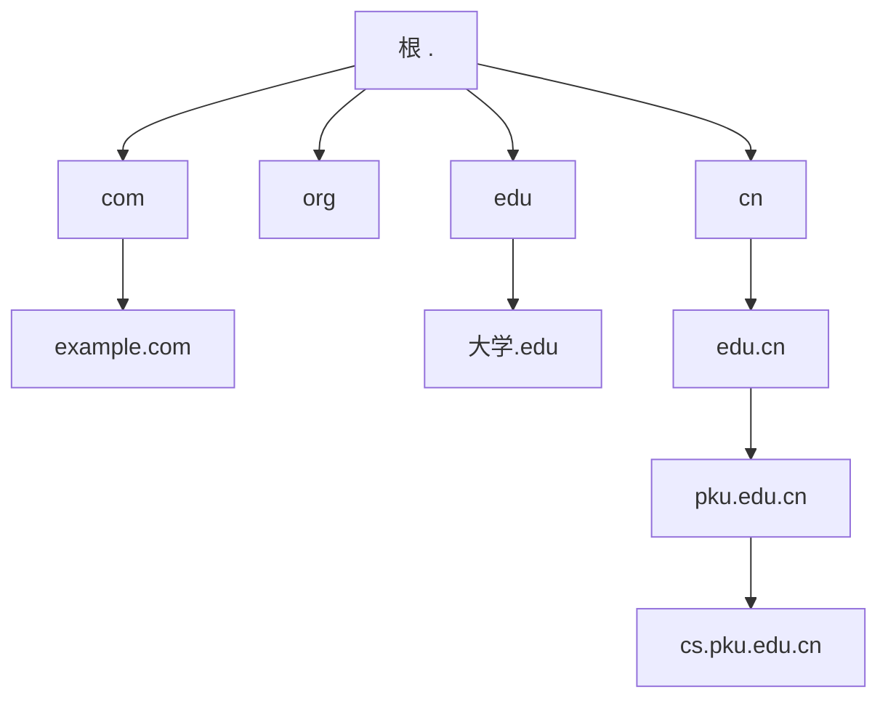
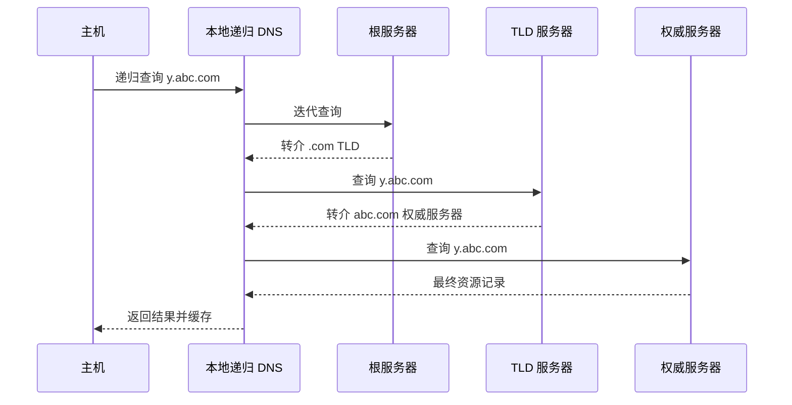
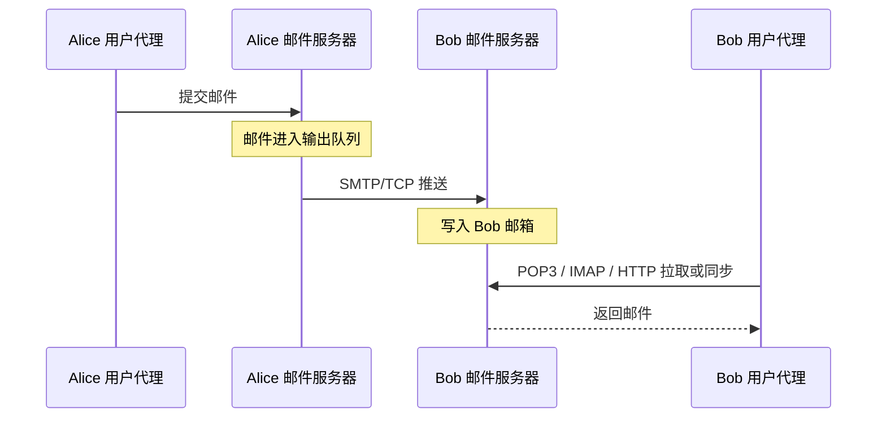

# 第四章　应用层（二）：DNS 与电子邮件

> 对应课件：`第二讲_应用层-(2)DNS、电子邮件.pptx`。

## 1. 域名系统 DNS

### 1.1 目标与基本映射

网络层用定长 IP 地址识别接口：IPv4 为 32 位，IPv6 为 128 位；用户更容易记住字符串域名。DNS（Domain Name System）维护域名和 IP 地址等资源之间的映射，既可由域名查询地址，也可由地址反向查询域名。

DNS 的功能与网络层寻址密切相关，但被实现为端系统上的应用层服务，体现了把复杂功能放到网络边缘的设计思想。

映射并非简单的一对一：

- 一台主机可有多个别名，其中一个是规范名（canonical name）；
- 多个域名可指向同一 IP；
- 一个域名也可返回多个 IP，由多台主机共同服务，实现负载均衡、容错和就近访问。

ARPANET 早期用集中维护的 `hosts.txt` 保存全部名称和地址，各主机定期下载。网络扩大后，文件越来越大，更新和名称冲突难以集中管理。1987 年发布 RFC 1034/1035，DNS 改用层次化、分布式结构。操作系统至今仍保留 `hosts` 文件，通常优先于 DNS 查询。

### 1.2 为什么不能中心化

DNS 面对数十亿记录和每天万亿级查询，读远多于写，且要求毫秒级响应。单一中心会产生性能瓶颈、远距离时延和单点故障，也无法让数百万组织独立管理各自名字空间。因此 DNS 在逻辑上是分布式数据库，在物理上由大量域名服务器共同实现。

## 2. 域名空间与管理

域名空间是一棵树。完整域名由多个 label 组成，以点分隔，总长不超过 255 个字符；每个 label 最长 63 个字符。一般写作：

```text
主机名.三级域名.二级域名.顶级域名
```



### 2.1 顶级域

- 国家/地区顶级域 ccTLD，例如 `.cn`、`.us`、`.uk`；课件给出 300 多个的历史统计。
- 基础设施域 `.arpa`，用于 Internet 基础设施；课件列出 `ip6.arpa`、`in-addr.arpa`、`iris.arpa`、`uri.arpa`、`urn.arpa`、`home.arpa`、`as112.arpa`、`in-addr-servers.arpa`、`ipv4only.arpa` 等二级域。
- 通用顶级域 gTLD。早期包括 `.com`、`.net`、`.org`、`.edu`、`.gov`、`.mil`、`.int`，后来增加 `.aero`、`.biz`、`.cat`、`.coop`、`.info`、`.jobs`、`.museum`、`.name`、`.pro`、`.tel`、`.travel`、`.mobi` 等，以及公司品牌和多语种顶级域。

某些 ccTLD 因英文含义获得商业价值，例如 `.ai`、`.tv`、`.io`。这是域名注册的市场现象，不改变 DNS 技术结构。

### 2.2 `.cn` 下的二级域

- 类别域：`.com.cn`、`.ac.cn`、`.mil.cn`、`.edu.cn`、`.gov.cn`、`.org.cn`、`.net.cn` 等。
- 行政区域域名：各省、直辖市、自治区和特区使用两个字母，例如北京 `bj`、河北 `he`。
- 无类别二级域，例如 `baidu.cn`。

### 2.3 注册管理

ICANN（Internet Corporation for Assigned Names and Numbers）负责全球域名与号码体系的协调；各 ccTLD 下的结构由相应国家/地区决定。域名管理逐级授权：上级管理机构把子域交给下级，注册服务商面向申请者提供注册服务。课件例子中，`.edu.cn` 下三级域名由 CERNET 负责，其他中国二级域相关注册由 CNNIC 管理。

## 3. 域名服务器层次

DNS、电子邮件/011-b313faefdc.png>)

### 3.1 根服务器

- 根服务器知道所有 TLD 名字服务器的名称和地址，但通常不直接返回最终主机地址，而是给出下一层转介。
- IPv4 根服务器有 13 个逻辑身份，名称为 `a.root-servers.net` 到 `m.root-servers.net`；“13 套”并不等于全球只有 13 台物理机器。
- 每个逻辑根通过镜像/任播在许多站点部署，数据保持同步，使客户端通常可以就近访问并提高可靠性。课件给出“1000 多台镜像”的历史规模。

### 3.2 TLD 与权威服务器

- TLD 服务器管理其顶级域下注册的二级域。响应可能是最终答案，也可能是下一层权威服务器地址。
- 组织把自己的域划为一个或多个 **zone（区）**，每个区由权威服务器负责。区可以等于或小于域，不能大于域；子域可被委派为独立区。
- 每台公开主机的记录最终应注册在某个权威服务器中。

### 3.3 本地/递归 DNS

ISP、企业或校园通常至少有一个靠近用户的本地递归解析器。它不属于根—TLD—权威的授权层次，而是替客户端完成查询、缓存结果。实际部署中递归解析器也可能分多层。

## 4. 域名解析

应用把域名放入 DNS 请求并发给本地 DNS；解析器把结果放入响应返回给应用。

### 4.1 递归与迭代

- **递归查询**：被查询服务器若不知道答案，替请求者继续查，最终返回答案或错误；客户端无须联系其他服务器。主机到本地 DNS 通常使用递归。
- **迭代查询**：服务器若不知道最终答案，返回它所知道的下一台服务器；请求者继续发起新查询。本地 DNS 向根、TLD 和权威服务器通常使用迭代。

实际路径是组合：主机递归请求本地解析器；解析器先查缓存，未命中时迭代访问根、TLD、权威服务器，再把最终答案递归返回给主机。



## 5. DNS 协议与报文

传统 DNS 主要使用 UDP 端口 53；较大响应、区域传送等场景也可能使用 TCP。查询和响应结构基本相同，分为 12 字节基础首部、问题区和资源记录区。

### 5.1 基础首部

| 字段 | 含义 |
|---|---|
| Transaction ID | 事务标识，请求与对应响应相同 |
| Flags | 查询/响应、递归、权威、截断和错误等标志 |
| QDCOUNT | 问题数 |
| ANCOUNT | 回答资源记录数 |
| NSCOUNT | 权威资源记录数 |
| ARCOUNT | 附加资源记录数 |

Flags：

- `QR`：0 为查询，1 为响应。
- `Opcode`：0 标准查询，课件另列 1 反向查询、2 服务器状态查询。
- `AA`：响应来自权威服务器。
- `TC`：响应被截断；传统 UDP DNS 超过 512 字节时会发生，现代 EDNS 可扩展 UDP 负载。
- `RD`：客户端期望服务器递归解析。
- `RA`：服务器在响应中表明支持递归。
- `Z`：保留位，必须为 0。
- `Rcode`：0 `NoError`，1 `FormErr`，2 `ServFail`，3 `NXDomain`，4 `NotImp`，5 `Refused`。

`RD=1` 只表示请求递归；服务器是否支持由 `RA` 反映。不支持递归或 `RD=0` 时，服务器可返回转介信息供客户端迭代。

### 5.2 问题区

通常包含一个问题：

- `QNAME`：待查询域名；反向查询时是特殊形式的地址名。
- `QTYPE`：资源类型，例如 `A`。
- `QCLASS`：通常为 `IN`（值 1），课件还列出早期网络的 `CS`、`CH` 等类。

### 5.3 资源记录 RR

回答、权威服务器和附加信息三个区域都由资源记录构成：

```text
(NAME, TTL, CLASS, TYPE, RDLENGTH, RDATA)
```

- `TTL` 以秒计，决定记录可缓存多久，也反映记录的预期稳定性。
- `RDLENGTH` 给出 `RDATA` 长度；`RDATA` 的含义由 `TYPE` 决定。

常见类型：

| TYPE | NAME 与 RDATA |
|---|---|
| A | 主机名 → IPv4 地址 |
| AAAA | 主机名 → IPv6 地址 |
| CNAME | 别名 → 规范名 |
| NS | 域名 → 其权威名字服务器主机名 |
| MX | 域名 → SMTP 邮件服务器及优先级 |
| SOA | 区域的权威与刷新等管理信息 |
| TXT | 与主机/域关联的文本说明或策略数据 |
| PTR | 反向地址名 → 域名 |

课件给出的记录例子：

```text
cs.vu.nl. 86400 IN SOA hostmaster.cs.vu.nl. 2020091500 7200 3600 2419200 7200
cs.vu.nl. 7200  IN MX 10 mx2.surfmailfilter.nl.
cs.vu.nl. 86400 IN NS new-ns2.vu.nl.
google.com. 299 IN AAAA 2a00:1450:4017:804::200e
69.174.82.46.in-addr.arpa. 35078 IN PTR p2e52ae45.dip0.t-ipconnect.de.
p2e52ae45.dip0.t-ipconnect.de. 86400 IN A 46.82.174.69
www.cs.vu.nl. 60 IN CNAME papac022.vu.nl.
```

## 6. DNS 缓存与安全

递归服务器和主机缓存最近查询的记录，以及根/TLD 转介信息。缓存可以缩短时延、减少根服务器负荷和 DNS 报文数量。每条记录按 TTL 过期：TTL 较长减少查询开销，但地址变化传播更慢；TTL 较短提高新鲜度，但增加负荷。课件以约 48 小时作为传统示例，并非所有记录的固定值。

传统 DNS 的弱点是大量请求基于 UDP 明文传输，资源记录本身缺少认证和加密，因而存在隐私泄露、伪造和缓存污染风险。

**DNSSEC**用数字签名保证 DNS 数据的来源真实性和完整性，并能认证“不存在”的结果：权威服务器用私钥签名 RR 集，验证解析器用公开密钥验证；验证失败说明响应可能伪造或在传输/缓存中被篡改。DNSSEC 不以隐藏查询内容为目标。

## 7. 电子邮件体系结构

电子邮件系统由用户代理、邮件传输代理/服务器和协议组成：

- 用户代理负责撰写、发送、接收、阅读、组织邮件和地址簿，可表现为桌面程序、手机 App 或 Web 客户端。
- 邮件服务器中，邮箱保存用户收到的邮件，输出队列保存等待转发的邮件。
- SMTP 用于发送和服务器间中继；POP3、IMAP 或 Webmail 用于最终访问。



## 8. 邮件格式：RFC 5322 与 MIME

SMTP 定义如何传输邮件；RFC 5322 定义邮件内容的基本格式。邮件由首部、空行和正文组成。基本 ASCII 邮件至少有 `From`、`To`，并可包含：

| 字段 | 含义 |
|---|---|
| To / Cc / Bcc | 主收件人、抄送、密送 |
| From / Sender | 创建消息者、实际发送者 |
| Received | 每个沿途传输代理添加一行，记录路径 |
| Return-Path | 返回发件方的路径 |
| Date / Reply-To | 发送时间、回复地址 |
| Message-ID | 邮件唯一标识 |
| In-Reply-To / References | 被回复邮件和相关会话的 Message-ID |
| Keywords / Subject | 用户关键词、简短主题 |

MIME（Multipurpose Internet Mail Extensions）扩展消息体结构和非 ASCII 编码，使邮件能携带多媒体与二进制文件。新增首部包括 `MIME-Version`、`Content-Description`、`Content-ID`、`Content-Transfer-Encoding` 和 `Content-Type`。

常见媒体类型及子类型：

| 类型 | 示例子类型 |
|---|---|
| `text` | `plain`、`html`、`xml`、`css` |
| `image` | `gif`、`jpeg`、`tiff` |
| `audio` | `basic`、`mpeg`、`mp4` |
| `video` | `mpeg`、`mp4`、`quicktime` |
| `font` | `otf`、`ttf` |
| `model` | `vrml` |
| `application` | `octet-stream`、`pdf`、`javascript`、`zip` |
| `message` | `http`、封装邮件 |
| `multipart` | `mixed`、`alternative`、`parallel`、`digest` |

多部分邮件用 boundary 分隔多个实体，每部分有自己的 `Content-Type` 和编码：

DNS、电子邮件/025-c8f9e45b79.png>)

## 9. SMTP

SMTP 用 TCP 端口 25 在邮件服务器间可靠传递邮件。逻辑上是发送方直接向接收方**推送**，经历连接建立、邮件传送和连接关闭。客户端发送 ASCII 命令，服务器返回状态码和短语。

典型会话：

```text
S: 220 hamburger.edu
C: HELO crepes.fr
S: 250 Hello crepes.fr, pleased to meet you
C: MAIL FROM:<alice@xyz.com>
S: 250 Sender ok
C: RCPT TO:<bob@someschool.edu>
S: 250 Recipient ok
C: DATA
S: 354 Enter mail, end with "." on a line by itself
C: Do you like ketchup?
C: How about pickles?
C: .
S: 250 Message accepted for delivery
C: QUIT
S: 221 closing connection
```

同一邮件可用多个 `RCPT TO` 指定多个收件人。课件列出的 SMTP 命令还包括 `RSET`、`SEND FROM`、`SOML FROM`、`SAML FROM`、`VRFY`、`EXPN`、`HELP`、`NOOP`、`TURN`。

基础 SMTP 的不足是缺少认证、只面向 7 位 ASCII、可伪造 `FROM`、无加密且二进制编码效率低。扩展 SMTP 增加：

- `AUTH`：客户端认证；
- `BINARYMIME`：接受二进制消息；
- `CHUNKING`：分块传输大消息；
- `SIZE`：发送前检查消息大小；
- `STARTTLS`：升级到 TLS 安全传输；
- `UTF8SMTP`：国际化地址。

## 10. POP3、IMAP 与 Webmail

SMTP 是推协议；用户取信是拉操作，而且用户代理不一定在线，因此需要单独的邮件访问协议。

### 10.1 POP3

POP3（RFC 1939）使用 TCP 端口 110，采用 C/S 方式，分三阶段：

1. **认证**：`USER`、`PASS`，服务器返回 `+OK` 或 `-ERR`；
2. **事务处理**：`STAT`、`LIST [msg]`、`RETR msg`、`DELE msg`、`NOOP`、`RSET`；
3. **更新**：`QUIT` 后真正删除已标记邮件并结束会话。

可选命令包括 `APOP name digest`、`TOP msg n` 和 `UIDL [msg]`。

### 10.2 IMAP

IMAP 服务器监听 TCP 端口 143。与 POP3 的关键区别是邮件主要保留在服务器，客户端同步邮件与状态；用户可以从不同设备访问同一邮箱，并在服务器端维护已读状态、文件夹等。

| 特性 | POP3 | IMAP |
|---|---|---|
| 典型存储 | 下载到用户设备，可配置是否保留副本 | 服务器为主 |
| 阅读方式 | 适合离线 | 适合在线/同步 |
| 连接时间 | 较短 | 较长 |
| 服务器资源 | 少 | 多 |
| 多邮箱/文件夹 | 不擅长 | 支持 |
| 备份责任 | 更多由用户承担 | 更多由服务商承担 |
| 移动与多设备 | 较弱 | 较好 |
| 下载控制/部分下载 | 较少 | 较强 |
| 实现复杂度 | 低 | 高 |

### 10.3 Webmail

Webmail 把浏览器作为用户代理，用户与邮件服务之间通过 HTTP 交互；不同邮件服务器之间仍通常用 SMTP。它提供的是访问界面和应用逻辑，并没有取消服务器间的 SMTP 传输。

## 11. 本章小结

DNS 用分层命名、授权服务器、递归解析、迭代查询和缓存，把域名解析扩展到全球规模；DNSSEC补充数据认证。电子邮件则把消息格式、服务器间推送和用户最终拉取分离：RFC 5322/MIME 描述邮件，SMTP 传递邮件，POP3/IMAP/HTTP 提供用户访问。
